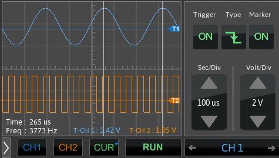

# PocketOZ on STM32F746 Discovery kit
  

# Official version of TouchGFX

the following project use the ST touch GFX with no Evaluation watermark

# Features

* 2 input channels
* Sampling rate up to 1 MSample/s per channel
* Maximum input voltage 3.3V
* Rising/Falling edge trigger
* voltage level and time scale control

## Hardware

* STM32F746-DISCO Kit [link](https://www.st.com/en/evaluation-tools/32f746gdiscovery.html)

## Software

These tools are used for developing the application

* Microsoft Visual Studio (Graphical interface development)
* Keil (Embedded firmware development)

# Contact

email: maher.mastouri@gmail.com
